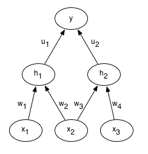

# Convolutional Neural Networks (CNNs / ConvNets)
- Make explicit assumption that the inputs are images
- This allows to encode certain properties into the architecture
- Vanilla neural nets don't scale well to full images. Say image of size 32x32x3, the net would have 32*32*3 = 3072 weights.
- 3D volumes of neurons => Layers of a CNN have neurons arranged in 3 dimensions: width, height, depth
- Sequence of layers, every layer transforms one volume of activations to another through a differentiable function.

## Layers used
Convolutional Layer, Pooling Layer, and Fully-Connected Layer
e.g. :
- INPUT [32x32x3] will hold the raw pixel values of the image
- CONV layer : computes the output of neurons that are connected to local regions in the input, each computing a dot product between their weights and a small region they are connected to in the input volume. So say we use 12 filters, this results in -> [32x32x12]
- RELU : applies an elementwise activation function such as $max(0,x)$ thresholding at zero. This leaves the volume unchanged.
- POOL : performs a downsampling operation along the spatial dimension (width, height) -> [16x16x12]
- FC : computes the class scores, resulting in a volume size [1x1x10], if we have 10 categories. Each neuron in this layer will be connected to all the numbers in the previous volume.

Note : Some layers contain parameters and others don't. In particular, CONV/FC layers perform transformations that are a function of both input volume and also parameters (the weights and the biases of the neurons). RELU/POOL however implement a fixed function.
The parameters in the CONV/FC layers are trained with gradient descent.

## Convolutional Layer
This is the core building block. The layer's parameters consist of a set of learnable filters. Every filter is small spatially but extends through the full depth of the input volume. During forward pass, we slide each filter across the width and height of the input volume and compute dot products between the entries of the filter and the input at any position. As we do this we will produce a 2-dimensional activation map that gives the responses of that filter at every spatial position. So this way the network learns filters that activate when they see some type of visual feature such as an edge of some orientation or a blotch of some color. So in this case we will have an entire set of filters in each CONV layer (12 filters) and each will produce a separate 2-dimensional activation map. We then stack these activation maps along the depth dimension and produce the output volume.

In terms of connectivity, the connections are local in space (that is along width and height) but always full along the entire depth.

Let's take an example : Say we have input volume [32x32x3]. If the receptive field (i.e. filter size) is 5x5, then each neuron in the Conv Layer will have weights to a [5x5x3] region in the input volume, so total 5*5*3 = 75 weights plus bias.
Now say the input volume has [16x16x20]. Using filter 3x3, we now have 3*3*20 = 180 connections to the input volume.

### Spatial Arrangement
Three hyperparameters control the size of the output volume: the depth, stride and zero-padding.
1. The depth : corresponds to the number of filters we would like to use, each learning to look for something different in the input. We will refer to a set of neurons that are looking at the same regions of the input as a depth column (or fibre).
2. Stride with which we slide the filter. When the stride is 1 we move the filters one pixel at a time. When the stride is 2 then the filters jump 2 pixels at a time as we slide them around.
3. Sometimes it is convenient to pad the input volume with zeros around the border. The nice feature of zero padding is that it will allow us to control the spatial size of the output volumes.

So in order to compute the spatial size of the output volume, say W = input volume size, F = the receptive field size, S = stride and P = zero padding on the border. So the formula for calculating how many neurons fit is (W - F + 2P)/S + 1.
So if input is 7x7 and 3x3 filter with stride 1 and pad 0 then we get output 5x5. If stride is 2, then 3x3.

### Parameter Sharing
Controls the number of parameters.

### Weight tying

Let's look at what weight tying does to gradients, computed using the backpropagation algorithm. Say we have three input units, $x_1$, $x_2$, $x_3$, two $logistic$ hidden units, $h_1$, $h_2$, four input to hidden weights $w_1$, $w_2$, 
$w_3$, $w_4$ and two hidden to output weights $u_1$, $u_2$. The output neuron $y$ is a linear neuron and we are using the squared error cost function.
Here's a diagram of this network : 

Now consider a single training case where target output is $t$. The forward propagation steps are :

\begin{align}
    z_1 = w_1 x_1 + w_2 x_2 \\
    z_2 = w_3 x_3 + w_4 x_4 \\
    h_1 = \sigma (z_1) \\
    h_2 = \sigma (z_2) \\
    y = u_1 h_1 + u_2 h_2 \\
    E = \frac{1}{2}(t - y)^2
\end{align}

Suppose we decide to tie the weights so that $w_1 = w_2 =w_{tied}$. 
Q - What is the derivative of the error $E$  w.r.t. $w_{tied}$ ?

A - Starting from the error, backpropagation works by repeated application of the chain rule. Let's look at $\frac{\partial E}{\partial w_2}$ and let's forget about weight tying for now :

\begin{align}
    \frac{\partial E}{\partial w_2} = \frac{\partial E}{\partial y} \frac{\partial y}{\partial h_1} \frac{\partial h_1}{\partial z_1} \frac{\partial z_1}{\partial w_2} \\
    \frac{\partial E}{\partial y} = - (t - y) \\
    \frac{\partial y}{\partial h_1} = u_1 \\
    \frac{\partial h_1}{\partial z_1} = h_1 (1 - h_1) \\
    \frac{\partial z_1}{\partial w_2} = x_2
\end{align}

So  $\frac{\partial E}{\partial w_2}  = -(t-y)u_1h_1(1-h_1)x_2 $ and we compute the same for $\frac{\partial E}{\partial w_1}$, then :
\begin{align}
    \frac{\partial E}{\partial w_{tied}} = \frac{\partial E}{\partial w_1} + \frac{\partial y}{\partial w_2} \\
    = −(t−y)u1h1(1−h1)x1−(t−y)u1h1(1−h1)\\
    = −(t−y)(u1h1(1−h1))(x1+x2)
\end{align}

So we looked at the equation to find the sequence of derivatives we would need for backpropagation. We can also look at the picture.

### Pooling
Process of combining the outputs of several hidden units to create a single hidden unit. This introduces some invariance to local transformations in the input image.

### Dimension Hopping
Dimension hopping occurs when one can take the information contained in the dimensions of some input and move this between dimensions while not changing the target. The canonical example is taking a mnist image and translating it within the image. The dimensions that contain "ink" are now different as they have now been moved to other dimensions. However the label we assign to that digit has not changed. So when the viewpoint changes, this causes "dimension hopping".

