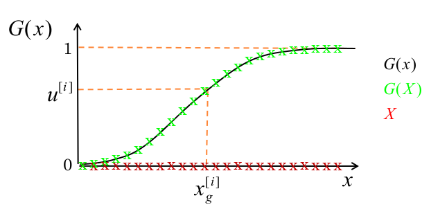

# Particle Filters

- Maintain a sample set representation of beliefs
- Also called Sequential Monte Carlo methods
- Instead of assuming Gaussian, tracking $\mu_t$, $\sum_t$, generate a set of sample states from each distribution
    - Each sample is a hypothesis about the current state
    - Properties of the whole collection of samples used to generate estimates
- Need Importance Sampling

## Generating samples from a distribution
- Given a state $x \in R$ and a distribution $g(x):R \rightarrow [0,1]$
    - Create a vector $X$ of evenly spaced values of $x$ over the range of interest
    - Create an exact/approx cumulative distribution vector, $G(X)$. Either integrate probability distribution or sum probabilities and normalize.
    - Draw samples from a uniform distribution over $[0,1]$.
    - Find the closest value to sample in $G(X)$ -> $x_{g^{[i]}}$

## Importance Sampling
- Perform calculation using a distribution $f(x)$ without being able to sample it directly.
- General technique for estimating properties of a particular distribution while having samples generated from a different distribution than the distribution of interest.
- Can first sample a different distribution, $g(x)$.

## The Particle Set
- A sample can be drawn from a proposal distribution $x_p^{[i]}$
- The sample is assigned a weight   $w_p^{[i]}$.
- The combination of sample and weight is a particle $s^{[i]}_p = \{x_p^{[i]}, w_p^{[i]}\}$
- The particle set is used to generate an approximation to the target distribution  $s^{[i]} = \{x^{[i]}, w^{[i]}\}$ $S =\{s^{[1]},...,s^{[1]}\}$
- $I$ is the total number of particles and approximation improves as $I \rightarrow \infty$.

## Define the Model
- State prior   $p(x_0)$
- Motion Model  $p(x_t | x_{t-1}, u_t)$
- Measurement Model $p(y_t | x_t)$

## Beliefs
- Belief distribution represented by particle set
\begin{align}
    x_t^{[i]} \sim bel(x_t) = p(x_t | y_{1:t}, u_{1:t}) \\
    S_t = \{s^{[1]}_t,...,s^{[I]}_t\}
\end{align}
- Predicted belief
\begin{align}
    \bar{x}_t^{[i]} \sim \bar{bel}(x_t) = p(x_t | y_{1:t-1}, u_{1:t}) \\
    \bar{S}_t = \{\bar{s}^{[1]}_t,...,\bar{s}^{[I]}_t\}
\end{align}

## Particle Filter Algorithm
- For each particle in $S_{t-1}$
    - Propagate sample forward using motion model i.e. sampling $x^{[i]}_t \sim p(x_t | x^{[i]}_{t-1}, u_t)$
    - Calculate weight i.e. importance  $w^{[i]}_t = p(y_t | x^{[i]}_t)$
    - Store in interim particle set $S'_t = S'_t + \{s^{[i]}_t\}$
- For $j=1$ to $D$
    - Draw index $i$ with probability $\propto w^{[i]}_t$  i.e. resampling
        - Add the final particle set    $S_t = S_t + \{s^{[i]}_t\}$

