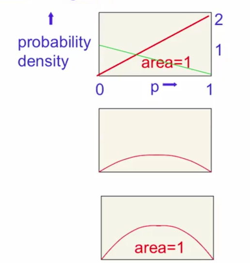

# The Bayesian framework
- Assumes that we always have a prior distribution for everything.
  - The prior may be vague.
  - When we see some data, we combine our prior distribution with a likelihood term to get a posterior distribution.
  - The likelihood terms takes into account how probable the observed data is given the model parameters.
    - Favors parameter settings that make the data likely.
    - Fights the prior.
    - With enough data the likelihood term always wins.

# Bayesian Theorem
- In Bayesian view, probabilities provide a quantification of uncertainty.
- From a Bayesian perspective, we can use probability theory to describe the uncertainty in model parameters such as $w$.
- We capture out assumption about $w$ before observing the data, in the form of a prior probability distribution $p(w)$.
- The effect of the observed data $D = {t_1,...,t_N}$ is expressed through the conditional probability $p(D|w)$.
- Bayes' theorem takes the form
\begin{equation}
  p(w|D) = \frac{p(D|w)p(w)}{p(D)}
\end{equation}
- This allows us to evaluate the uncertainty in $w$ \textit{after} we have observed $D$ in the form of the \textit{posterior}
probability $p(w|D)$.
- The quantity $p(D|w)$ is evaluated for the observed data set $D$ and can be viewed as a function of the parameter vector $w$,in which case it is called the \textit{likelihood function}.
- It expresses how probable the observed data set is for different settings of the parameter vector $w$.
- The denominator is the normalization constant which ensures that the posterior distribution on the left-hand side is a valid probability density and integrates to one.
- We can state Bayes' theorem :
\begin{equation}
  posterior $\alpha$ likelihood $\alpha$ prior
\end{equation}
- Integrating both sides w.r.t. $w$ we can express the denominator in Bayes' theorem in terms of the prior distribution and the likelihood function
\begin{equation}
  p(D) = \int_ p(D|w)p(w) dw.
\end{equation}

## Error function
The negative log of the likelihood function. Because the negative logarithm is a monotonically decreasing function, maximizing the likelihood is equivalent to minimizing the error.

## Coin tossing example
- Say we know nothing about coins except that each tossing produces head with probability $p$ and rail $p-1$.
- Suppose we observe 100 tosses and 53 are head :

### Maximum likelihood
Frequentist estimator in which $w$ is set to the value that maximizes the likelihood function $p(D|w)$.
So in the example above if we pick $P$ that makes the observation of 53 heads most probable $p=0.53$.

\begin{align}
  P(D) = p^53 (1- p)^47 \\
  \frac{dP(D)}{dp} = 53p^52(1-p)47 - 47p^53(1-p)46 \\
  = (frac{53}{p} - \frac{47}{1-p})[p^53(1-p)47] \\
  = 0 if p=.53
\end{align}

Problem with this approach, that is picking parameters that are most likely to generate the data, is that :
- What if we tossed the coin once and got 1 head? $p=1$ is not sensible. Surely $p=0.5$ seems better.
- Our computation of probabilities will work much better if we take into account uncertainty.

## Using a distribution
- Start with a prior distribution over $p$. Let's use a uniform distribution.
- Multiply the prior probability by the probability of observing a head.
- Normalize so that the area is 1.

- Now the green line shows the probability that we get a tail. So if $p=1$ the probability of getting tail is zero.
So we multiply our prior by the likelihood term and then we get a nice curve. Last step is normalized.

If we do this another 98 times, we get the same surve with a highly sharp peak.

## Bootstrap
- An approach to determining frequentist error bars using multiple data sets.
Suppose original data consists of $N$ data points $X = {x_1,...,x_N}$. We can create a new data set $X_B$ by drawing $N$ points at random from $X$, with replacement, so that some points may be replicated. This process is repeated $L$ times.
The statistical accuracy of parameter estimates can be evaluated by looking at the variability of predictions between the different bootstrap datasets.

# Bayesian Classifier
In theory we would like to predict qualitative response using the Bayes classifier. But for real data, we don't know the conditional distribution of Y given X and so computing the Bayes classifier is impossible. The Bayes classifier serves as an unattainable gold standard against which to compare other methods.

Some notation :
- Density is $f_k(x) = P(X = x| Y=k)$
- Prior probability of class k is $\pi_k$

# Naive Bayes
Naive Bayes methods are a set of supervised learning algorithms based on applying Bayes' theorem with the 'naive' assumption of independence between every pair of features. Given a class variable $y$ and a dependent feature vector $x_1$ through $x_n$ Bayes' theorem states the following relationship:

\begin{equation}
P(y |x_1,...,x_n) = \frac{P(y)P(x_1,...,x_n|y}{P(x_1,...,x_n}
\end{equation}

Different naive Bayes classifiers differ by assumptions they make regarding the distribution of $P(x_i | y)$.
Due to decoupling of the class conditional feature distribution it means each distribution can be independently estimated as a one dimensional distribution. In other words, the algorithm breaks a multivariate problem into univariate problems
Not only its fast it also helps to alleviate problems stemming from the curse of dimensionality.
Although they are known as descent classifier, they are bad at estimation problems.

