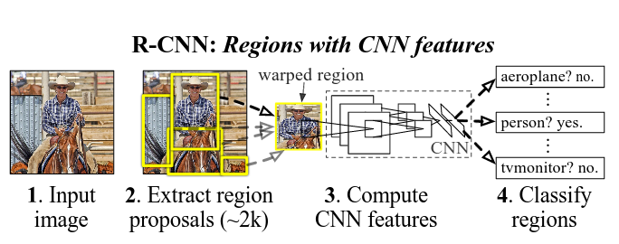
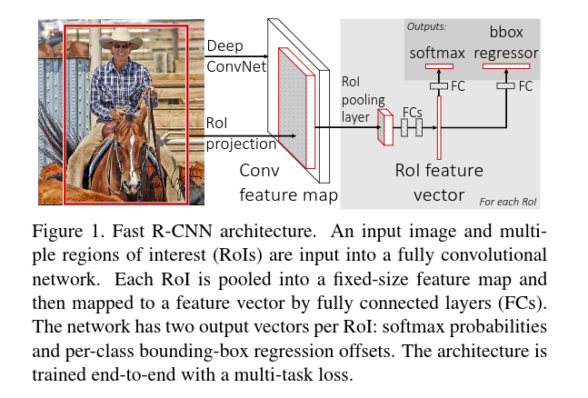
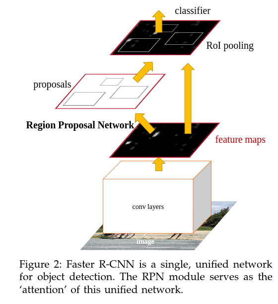
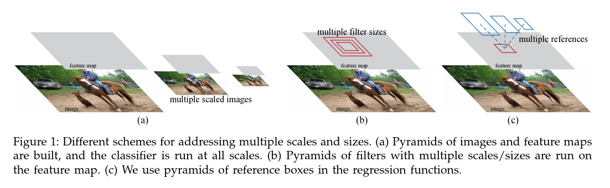
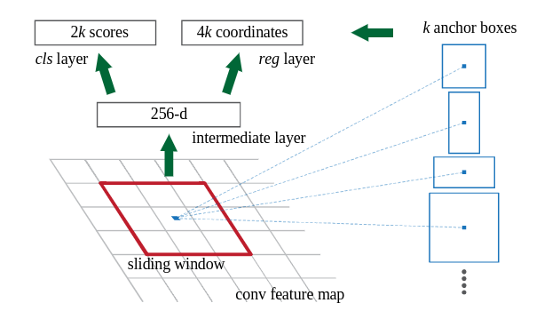

# R-CNN: Regions with CNN features

## Object detection with R-CNN
- Initial system consisted of three modules :
    - The first generates category-independent region proposals.
    These proposals define the set of candidate detections available
    to the detector.
    - The second module is a large CNN that extracts a fixed-length
    feature vector from each region.
    - Third module is a set of class-specific linear SVMs

### Region proposals
- Selective search to select the proposals

### Feature extraction
- 4096-dimensional feature vector from each region proposal
- Features computed by forward propagating a mean-subtracted
$227 x 277$ RGB image through 5 conv layers and 2 ridge(fc) layer.
- To compute features for a region proposal, need to convert the
image data in that region into a form that is compatible with CNN.
One way is to warp all pixels in a tight bounding box around it to
the required size. Prior to warping, dilate the tight bounding box
so that at the warped size there are exactly $p$ pixels of warped
image around the orignal box.

# Fast R-CNN

## R-CNN and SPPnet
- R-CNN is slow because it performs a ConvNet forward pass for
each object proposal, without sharing computation.
- Spatial pyramid pooling networks (SPPnet) were proposed to
speed up R-CNN by sharing computation.
- SPPnet computes a convolutional feature map for the entire
input image and then classifies each object proposal using a
feature vector extracted from the shared feature map.
- SPPnet has drawbacks:
    - Training is a multi-stage pipeline that involves extracting
    features, fine-tuning a network with log loss, training SVMs
    and finally fitting bounding-box regressors.

## Fast R-CNN Architecture
- Method to fix the disadvantage of R-CNN and SPPnet
- Higher mAP
- Training is single-stage using a multi-task loss
- Training can update all network layers
- No disk storage needed for caching

### Training
- Takes as input an entire image and a set of object proposals
- The network first process the whole image with several conv and
max pooling layers to produce a conv feature map.
- For each object proposal a region of interest (RoI) pooling layer
extracts a fixed-length feature vector from the feature map.
- Each feature vector is fed into a sequence of fc layers that finally
branch into two siblin output layers:
    - One that produces softmax probability estimates over $K$ object
    classes plus a catch-all ''background'' class and another layer
    that outputs four real-values numbers for each of the $K$ object
    classes.
    - Each set of 4 values encodes refined bounding-box position for
    one of the $K$ classes.

### RoI pooling layer
- uses max pooling to convert the features inside any valid region of
interest into a small feature map with a fixed spatial extent of $H \times W$.
- RoI is a rectangular window into a conv feature
- Each RoI is defined by a four-tuple $(r,c,h,w)$ that specifies its
top-left corner $(r,c)$ and its height and width $(h,w)$.
- RoI max pooling works by dividing the $h \times w$ RoI window into a
$H \times W$ grid of sub-windows of approximate size $h/H  \times w/W$
and then max-pooling the values in each sub-window into the corresponding
output grid cell.
- Pooling is applied independently to each feature map channel.
- The RoI layer is just special-case of the spatial pyramid pooling layer
used in SPPnets in which there is only one pyramid level.

## Fine-tuning for detection
- SGD mini-batches are sampled heirarchically, first by sampling $N$ images
and then by sampling $R/N$ RoIs from each image.
- RoIs from the same image share computation and memory in the forward and
backward passes.

### Multi-task loss
- Two sibling output layers
- First outputs a discrete probability distribution, per RoI
    - $p = (p_0,...,p_K)$. over $K + 1$ categories
- Second sibling layer outputs bounding box regression offsets
    - $t^k = (t^k_x, t^k_y, t^k_w,  t^k_h)$
- Multi-task loss $L$ on each labeled RoI to jointly train:

\begin{equation}
    L(p, u, t^u, v) = L_{cls}(p, u) + \lambda[u \geq 1] L_{loc}(t^u, v)
\end{equation}

- $ L_{cls}(p, u) = -log p_u$ is log loss for true class $u$
- The Iverson bracket indicator function $[u \geq q]$ evaluates to 1
when $u \geq 1 $ and 0 otherwise

The loss for BB regression

\begin{equation}
     L_{loc}(t^u, v) = \sum_{i \in {x,y,w,h}} smooth_{L1} (t^u_i - v_u),
\end{equation}

\begin{equation}
 smooth_{L1}(x)=
	\left \{
		\begin{aligned}
			0.5x^2  \quad if \quad {x} < 1 \\\
			|x| - 0.5  \quad otherwise,
		\end{aligned}
	\right.
\end{equation}

- $L_1$ loss is less sentitive to outliers than $L_2$ loss
- When the regression targets are unbounded, training with $L_2$ can require
careful tuning of the learning rates to prevent exploding gradients. Eq. 3 eliminates
this sensitivity.
- $\lambda$ controls the balance between the two task losses.

Note: Multi-task is convenient because it avoids managing a pipeline of sequentially-trained
tasks. But it also helps because the tasks influence each other through a shared representation

### Back-propagation thru RoI
- Routes derivatives thru the RoI pooling layer

# Faster R-CNN

## Region Proposal Networks
- Share convolutional layers with the object detection network
- By sharing convolutions, the marginal cost for computing proposals
is small
- Observation-> Convolutional feature maps used by region-based
detector can be used for generating region proposals.
- On top of these conv features, construct an RPN by adding a
few additional conv layers that simultaneously regress region
bounds and objectness socres at each location on a grid
- RPN is a FCN and can be trained end-to-end to generate proposals.
- RPNs are designed to efficiently predict region proposals with a wide
range of scales and aspect ratios.

- Takes an image (of any size) as input and outputs a set of rectangular
object proposals, each with an objectness score.
- To generate region proposals, slide a small network over the conv feature
map output by the last shared conv layer

Note: RPN needs to generate a lot of regions of interest. This is because
if an object is not detected during the first stage (region proposal),
there is no way to correctly classify it in the second phase.

### Anchor boxes

- Use the idea of ''anchor'' boxes that serve as references at multiple scales
and aspect ratio
- This pyramid of regression references, avoids enumerating images or filters
of multiple scales or aspect ratios

- At each sliding-window location, simultaneously predict multiple region proposals
- The max possible proposals is $k$
- $2k$ score probability of object or not object for each proposal
- $k$ proposals parameterized relative to $k$ reference boxes i.e. anchors
- An anchor is centered at the sliding window and is associated with a scale and aspect
ratio

### Translation-Invariant Anchors
- If one translates an object in an image, the proposal should translate
and the same function should be able to predict the proposal

## Region of interest pooling
- Fixed-size feature map obtained from a deep conv network with several conv and max pooling layers
- An $N \times 5$ matrix of representing a list of regions of interest,
where $N$ is a number of RoIs
    - The first column represents the image index and the remaining four are the coordinates of
    the top left and bottom right corners of the region

Q : What does RoI pooling do?
- For every region of interest from the input list,it takes a section of the
input feature map that corresponds to it and scales it to some pre-defined size
- Scaling is done by :
    - Dividing the region proposal into equal-sized sections
    - Find the largest value in each section
    - Copy these max values to the output buffer
- Result : From a list of rectangles with different sizes, we get a lit of corresponding
feature maps with a fixed size.
- The dimension of the RoI pooling output doesn't depend on the size of the input
feature map not on the size of the region proposals, but rather determined by the
number of sections we divide the proposal into
- Benefit? Processing speed. If there are multiple object proposals, we can use the
same feature map for all of them.

## RPN Loss Function
- Assign a binary class label (of being an object or not) to each anchor
- Assign a positive label to two kinds of anchors
    - Anchor with the highest IoU
    - Anchro with IoU higher than 0.7
    - A single ground-truth box may assign positive labels to multiple anchors
- Assign a negative label to a non-positive anchor if IoU is lower than 0.3
- Loss function for an image is :

\begin{equation}
    L({p_i}, {t_i}) = \frac{1}{N_{cls}} \sum_i L_{cls}(p_i, p^{*}_i) + \\
    \lambda \frac{1}{N_{reg}} \sum_i{p^{\star}} L_{reg}(t_i, t_i^{\star})
\end{equation}

- $L_{reg}(t_i, t^{\star}_i) = R(t_i, t^{\star}_i)$
    - $R$ is smooth $L_1$

## Training
- Both RPN and Fast-RCNN are trained independently
- Thus they will modify their conv layers in different ways
- Need a technique that allows for sharing conv layers between
the two networks, rather than separate learnings

### Alternating Training
- First train RPN
- Then use proposals to train Fast R-CNN
- Network tuned by Fast R-CNN is used to initialize RPN

### Approximate Joint Training
- RPN and Fast R-CNN are merged into one network during training (like in Figure 2)
- In each SGD iteration, the forward pass generates region proposals
which are treated just like fixed, pre-computed proposals when training Fast R-CNN
- For backpropagation, signals from both RPN loss and Fast R-CNN loss are combined
- Easy to implement but ignores the derivative w.r.t. the proposal boxes coordinates
    - So its an approximation
- Reduces training time by 25-50%

### Non-approximate Joint Training
- Theoretically valid backpropagation solver should involve gradients w.r.t.
the box coordinates
- These gradients are ignored in the above approaches
- Solution can be given by an ''RoI warping''

## 4-Step Alternating Training
- Step 1: Train RPN, initialize with ImageNet
- Step 2: Train a separate detection network by Fast R-CNN using proposals generated
in Step 1. This is also initialized with ImageNet
- Step 3: Use the detector network to initialize RPN BUT fix the shared conv
layers and only fine-tune the layers unique to RPN -> Now they share conv layers
- Step 4: Keep the shared conv layers fixed, fine-tune the unique layers of
Fast R-CNN

## Summary
- R-CNN method took the approach of cropping externally computed box proposals
out of an input image and running a neural net classifier on these crops
    - This can be expensive because many crops are necessary
    - This in turn leads to significant duplicated computation from overlapping
    crops
- Fast R-CNN alleviated this problem by pushing the entire image once through a feature extractor then cropping from an intermediate layer so that the crops share
the computation load of feature extraction
- Typical to have a collection of boxes overlaid on the image at different spatialocations, scales and aspect ratio that act as ''anchors''.
- A model is trained to make two predictions for each anchor
    - 1) a discrete class prediction for each anchor
    - 2) a continuous prediction of an offset by which the anchor needs
    to be shifted to fit the GT bounding box.
## R-FCN
- Region-based Fully Convolutional Network
- This is like Faster R-CNN but instead of cropping features from the same layer where region proposals are predicted, crops are taken from the last layer of features prior to prediction
- This pushing of cropping to the last layer minimizes the amount of per-region computation that must be done
- They then argue that object detection task needs localization representation that respect translation variance and thus propose a position-sensitive cropping mechanism that is used instead of the more standard ROI pooling operation.
