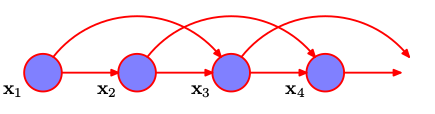

# Markov Models

The easiest way to treat sequential data is to forget about sequential aspects and treat the observations as i.i.d. But then we lose the sequential patterns in the data. Instead we can relax the i.i.d. assumption and one of the simplest ways is to to consider a *Markov model*.

We can use the product rule to express the joint distribution for a sequence of observations in the form

\begin{equation}
	p(x_1,...,x_N) = \prod_{n=1}^{N} p(x_n | x_1,...,x_{n-1}).
\end{equation}

Assuming each of the conditional distributions on the right-hand side is independent of all previous observations *except* for the most recent, we obtain the *first-order Markov chain*.

The joint distribution for a sequence of $N$ observations under this model is

\begin{equation}
	p(x_1,...,x_N) = p(x_1)\prod_{n=2}^{N} p(x_n |x_{n-1}).
\end{equation}

Now one way to allow earlier observations to have an influence is to move to higher-order Markov chains. Allowing predictions to depend also on the previous-but-one value gives a second-order Markov chain, like shown in the graph below.

\begin{equation}
	p(x_1,...,x_N) = p(x_1)px(x_2|x_1)\prod_{n=3}^{N} p(x_n |x_{n-1},x_{n-2}).
\end{equation}

## Autoregressive models
Try to predict the next term or the sequence from previous terms using "delay taps".
This is a memoryless model for sequences. A linear auto regressive would take a weighted average of those to predict the next term.
We can make this more complicated by adding hidden units. So in a feedforward neural net, we might take some previous input terms, put them through
some hidden units and predict the next term.

## Generative models
If we give a generative model some hidden state, and if we give this hidden state its own internal dynamics, we get a much more
interesting model which can store info in its hidden state for a long time.

## Linear Dynamical Systems
Generative models with real-valued hidden state that cannot be observed directly.
The hidden state has linear dynamics with Gaussian noise and produces the observations using a linear
model with Gaussian noise.
One nice property is that a linearly transformed Gaussian is a Gaussian. So the distribution over the hidden
state given the data so far is Gaussian. This can be computed using "Kalman filtering", a recusive way to update
the representation of the hidden state given the observations.

## Hidden Markov model
These models have a discrete one-of-N hidden state. Transitions between states are stochastic and controlled by a transition matrix.
We say the state is "hidden" because we can't be sure which state produced a given output.
To predict the next output we need to infer the probability distribution over hidden states.
Method based on dynamic programming enables us to do so.

### Limitation
When a hidden Markov model generates data, at each time step it must select one of its hidden states.
With $N$ hidden states it can only remember $log(N)$ bits about what it generated so far.
As the information increases, the number of required states becomes too large.

## Stochastic models
Linear dynamical systems and hidden Markov models are stochastic, but the posterior probability distribution over their hidden 
states given the observed data so far is a deterministic function of the data.
