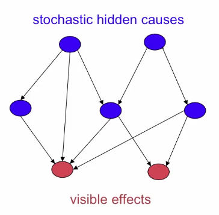

### Limitations of back-propagation
- Required labeled training data
- Learning time does not scale well
	- One reason was not initializing the weights in a sensible way.
- Can get stuck in poor local optima
	- These are often ok but for deep nets far from optimal.

### Overcomming limitations for backprop
- Using unsupervised learning
- Keep the efficiency and simplicity of using a gradient method for adjusting the weights
- But used for modeling the structure of the sensory input, not for modeling the relation between input and output.
- So the weights are going to be adjusted to maximize the probability that a generative model would have generated the sensory input.
- Then the learning objectivie for a generative model:
	- Maximise $p(x)$ not $p(y|x)$.

## Graphical models
- Graphs good for representing what depends on what.
- Probabilities then can be computed for nodes of the graph, given the states of other nodes.
- Belief Nets : 
	- Particular subet of graphs which are directed acyclic graphs, typically sparsely connected.	
	- If those graphs are sparsely connected, clever inference algorithms can compute the probabilities of unobserved nodes efficiently.

# Belief Nets
- Directed acyclic graph composed for stochastic variables.
- Here we treats nodes as hidden causes and visible effects (the ones we can see)
- We get to observe some of the variables and we would like to solve two problems:
	- The inference problem: Infer the states of the unobserved variables.
	- The learning problem: Adjust the interactions between variables to make the network more likely to generate the training data.

## Generative neural network composed of stochastic binary neurons
- Energy-based: Connect the binary stochastic neurons using *symmetric* connections to get a Boltzmann Machine.
	- As you know learning is hard so if we restrict the connectivity in a special way, becomes easier.
	- But when we do this we only learn one hidden layer so giving up a lot of power.
- Causal: Connect binary stochastic neurons in a *directed acyclic graph* to get a Sigmoid Belief Net.

## The wake-sleep algorithm
### The idea
- It's hard to learn complicated models like SBN (Sigmoid Belief Nets)
- Since it's hard to compute the correct posterior distribution, compute some cheap approximation to it.
- Do the inference wrong and maybe it will work. This turns out to be true for SBNs.
- At each hidden layer, assume (wrongly) the posterior over hidden configurations factorizes into a product of distributions for each separate hidden unit.

### Factorial distributions
- The probability of a whole vector is just the product of the probabilities of its individual terms:

### The algorithm (Hinton et. al. 1995)
- *Wake phase*: Use recognition weights to perform a bottom-up pass.
	- Train the generative weights to reconstruct activities in each layer from the layer above.
- *Sleep phase*: Use generative weights to generate samples from the model.
	- Train the recognition weights to reconstruct activities in each layer from the layer below.

