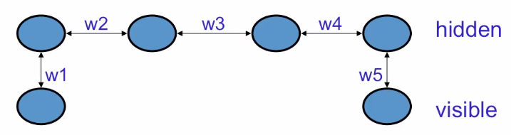
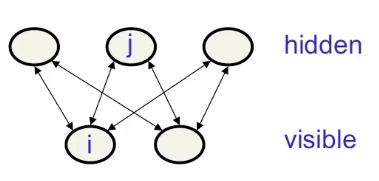

# Boltzmann Machine
- Stochastic Hopfield nets with hidden units are called Boltzmann machines
- They are good at modelling binary data, given a set of binary training vectors, they can use the hidden units to fit a model and assigns probability to every possible binary vector.
- Useful in cases such as monitoring complex systems to detect unusual behaviour. For example in a nuclear power station with binary dials, we want to detect if its in an unusual state even if its a state never seen before. So its not a supervised learning, its a model of normal states.
- If we have models of several different distributions it can be used to compute the posterior probability that a particular distribution produced the observed data.

\begin{equation}
	p(\textrm{Model i|data}) = \frac{p(\textrm{data|Model i})}{\sum_j p(\textrm{data|Model j})}
\end{equation}

- So given the observed data, the probability it came from Model |, under the assumption that it came from one of our models, is the probability that Model | would have produced the data divided by the same quantity for all models. 

## Data generation with a causal model
- In a causal model we generate data in two sequential steps:
	- Pick the hidden states (laten variables from their prior distribution
	- Then pick the visible states from their conditional distribution given the hidden states
- This is a kind of neural network, causal, *generative model*.
- It uses logistic units and biases for the hidden units and weights on the connections between hidden and visible units to assign a probability to every possible visible vector.
- The probability of generating a visible vector $v$ is computed by summing over all possible hidden states.

\begin{equation}
	p(v) = \sum_j p(h)p(v|h)
\end{equation}

## How a Boltzmann Machine generates data
- Energy based model, so we don't generate data causally.
- It's not a causal generative model.
- Everything is defined in terms of the energies of join configurations of visible and hidden units.
- The energies of joint configurations are related to their probabilities in two ways.
	- Define the probability to be $p(v,h) \alpha e^{-E(v,h)}$
	- Alternatively, define the probability of finding the net in that joint configuration after updating all the stochastic binary units many times.

## The energy of a joint configuration
\begin{equation}
	-E(v,h) = \sum_{i \in vis} v_ib_i + \sum_{k \in hid} h_kb_k + \sum_{i < j} v_iv_jw_{ij} + \sum_{i,k} v_ih_kw_{ik} + \sum_{k<l} h_kh_lw_{kl}
\end{equation}

- Put the negative energy to save having to put lots of minus signs.
- Here $v$ is on the visible units and $h$ on the hidden units, $b$ is bias of unit $k$.
- The visible-visible interactions
- Weight between visible unit $i$ and hidden unit $k$.

## Using energies to define probabilities
- The probability of a joint configuration over both visible and hidden units depends on the energy of that joint configuration compared with the energy of all other joint configurations.
\begin{equation}
	p(v,h) = \frac{e^{-E(v,h)}}{\sum_{u,g} e^{-E(u,g)}}
\end{equation}
- The denominator is usually called the partition function.
- To get the probability of a configuration of the visible units we take the sum of the probabilities of all the joint configurations.
\begin{equation}
	p(v,h) = \frac{\sum_h e^{-E(v,h)}}{\sum_{u,g} e^{-E(u,g)}}
\end{equation}
- If there are more than a few hidden units, we can't compute the normalizing terms (the partition function) because it has exponentially many terms.
- We can use Markov Chain Monte Carlo to get samples from the model starting at random global config:
	- Keep picking units at random and allowing them to stochastically update their states based on their energy gaps.
	- Run the Markov Chain until it reaches its stationary distribution (thermal equilibrium,$t=1$).
		- The probability of a global configuration is then related to its energy by the Boltzmann distribution.
\begin{equation}
	p(v,h) \alpha e^{-E(v,h)}
\end{equation}

Q. This is a Boltzmann Machine, what is $P(V_1 = 1, V_2 = 0)$ ? 

A. There are four configurations. Each has an energy and from the energies we can calculate the probabilities.
- $E(V_1 = 0, V_2=0) = 0$ because nothing is on.
- $E(V_1 = 0, V_2=1) = -1$.
- $E(V_1 = 1, V_2=0) = -1$.
- $E(V_1 = 1, V_2=1) = 0$.

Thus:
\begin{align}
	\sum_s exp(-E(s)) = exp(0) + exp(1) +exp(1) + exp(0) \approx 7.4366 \\
	E(V_1 = 1, V_2 =0) \approx \frac{exp(1)}{7.4366} \approx 0.366
\end{align}

## Boltzmann machine learning
- Want to maximize the product of the probabilities that the Botlzmann machine assigns to the binary vectors in the training set.
	- Equivalent to maximizing the sum of the log probabilities that the Boltzmann machine assigns to the training vectors.
- Also equivalent to maximizing the probability that we would obtain exactly $N$ training cases if:
	- Let the network settle to its stationary distribution $N$ different times with no external input.
	- Sample the visible vector once each time.
- What being learned here is the distribution over the visible vectors.

### Difficulty
Consider a chain of units with visible units at the ends

If the training set consistss of $(1,0)$ and $(0,1)$ we want the product of all the weights to be negative. Because we want the two visible units to be in opposite states. The way to achieve this is by making sure that the product of all those weights is negative. e.g. if all the weights are positive, turning on $w1$ will tend to turn on the first hidden unit and that will tend to turn on the second hidden unit etc.

So to know how to change $w1$ or $w5$ we need to know $w3$.

### Overcoming
- Everything that one weight needs to know about the other weights and the data is contained in the difference of two correlations.

\begin{equation}
	\frac{\partial log \quad p(v)}{\partial w_{ij}} = \Bigg \langle s_is_j \Bigg \rangle_v - \Bigg \langle s_is_j \Bigg \rangle_{model}
\end{equation}
- So if we take the log probability that the Boltzmann machine assigns to a visible vector $V$ and ask about the derivative of that log probability w.r.t. weight, $w_{ij}$.
- Then its the diff of the expected value of the products of the states $i$ and $j$.
- So the first term is the expected value of product of states at thermal equilibrium when $v$ is clamped on the visible units. That is how often $i$ and $j$ are on together when $v$ is clamped in visible units and the net is at thermal equilibrium minus the same quantity but when $v$ not clamped on the visible units.

\begin{equation}
	\bigtriangleup w_{ij} \quad \alpha \quad \Bigg \langle s_is_j \Bigg \rangle_{data} - \Bigg \langle s_is_j \Bigg \rangle_{model}
\end{equation}

- Since the derivative of the log probability of a visible vector, is diff of correlations we can make the change in the weight to be proportional to the expected product of the activities average over all visible vectors in the training set, called data, minus the product of the same two activities when not clamping the net.

### Hebbian learning rule
- What we did up there in the first term is the simplest form of Hebbian learning rule.
- The first term says raise the weights in proportion to the product of the activities the units have when presenting data.
- But if we only use this, synapse strength will keep growing so the weights will become too positive.
- To keep things under control we add the second term.
- Think of the first term as the storage term for a Hopfield Net and the second term like getting rid of spurious minima. This tells you how much unlearning to do.

## Restricted Botlzmann Machines
- Simplified architecture in which there are no connections between hidden units.
- Makes it easy to get the equilibrium distribution of the hidden units given the visible units.
- Only one layer of hidden units without connections.
- Architecture is essentially a bipartite graph.

### PCD: mini-batch learning for RBM
- Positive phase: Clamp a datavector on the visible units
- Negative phase: Keep a set of "fantasy particles", i.e. global configurations. Each particle has a value that is a global configuration.
	- Update each fantasy particle a few times using alternating parallel updates. 

### Some Maths
Q1. In RBMs the energy of any configuration is a linear function of the state.
\begin{equation}
	E(v,h) = - \sum_i a_iv_i - \sum_j b_j h_j - \sum_{i,j}v_ih_jW_{ij}
\end{equation}

This eventually leads to 
\begin{equation}
	\bigtriangleup W_{ij} \quad \alpha \quad \Big \langle v_ih_j \Big \rangle_{data} - \Big \langle v_ih_j \Big \rangle_{model}
\end{equation}

Say the energy was non-linear for some function $f$, so:
\begin{equation}
	E(v,h) = - \sum_i a_iv_i - \sum_j b_j h_j - \sum_{i,j}f(v_ih_j)W_{ij}
\end{equation}

Then :

\begin{align}
	p(v) = exp(-E(v,h))/Z \\
	log(p(v)) = -E(v,h) - log(Z) \\
	\frac{\partial log(p(v))}{\partial W_{i,j}} = f(v_j, h_j) - \sum_{v',h'} P(v'_i,h'_j)f(v'_i,h'_j)
\end{align}

Averaging over all data points,

\begin{align}
	\frac{\partial log(p(v))}{\partial W_{i,j}} = \Big \langle f(v_i, h_j) \Big \rangle_{data} - \Big \langle f(v_i, h_j) \Big \rangle_{model} \\
	\bigtriangleup W_{ij} \quad \alpha \quad \frac{\partial log(p(v))}{\partial W_{ij}} \\
	\bigtriangleup W_{ij} \quad \alpha \quad  \Big \langle f(v_i, h_j) \Big \rangle_{data} - \Big \langle f(v_i, h_j) \Big \rangle_{model}
\end{align}

Q2.In RBMs the energy of any configuration is a linear function of the state.
\begin{equation}
	E(v,h) = - \sum_i a_iv_i - \sum_j b_j h_j - \sum_{i,j}v_ih_jW_{ij}
\end{equation}

This eventually leads to 
\begin{equation}
	P(h_j=1|v) = \frac{1}{1 + e^{- \sum_j W_{ij}v_i - b_j}}
\end{equation}

If the energy was non-linear :
\begin{equation}
	E(v,h) = - \sum_i a_if(v_i) - \sum_j b_j g(h_j) - \sum_{i,j}f(v_i)g(h_j)W_{ij}
\end{equation}

Then :
\begin{equation}
	P(h_j=1|v) = \frac{1}{1 + e ^{((g(0) - g(1)) (\sum_j W_{ij} f(v_i) + b_j)}}
\end{equation}

