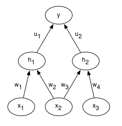

# Convolutional Neural Networks
- The name 'convolutional neural network' indicates that the network employs a mathematical operation called convolution.
- Convolution is a specialized kind of linear operation
- CNNs use convolution in place of general matrix multiplication.
- Make explicit assumption that the inputs with grid-like topology
- 3D volumes of neurons => Layers of a CNN have neurons arranged in 3 dimensions: width, height, depth

## Convolutional Op
- Convolution is an operation on two functions of a real valued argument
- In convolutional network terminology, the first argument is *input*, second is *kernel*. The output is referred to as the *feature_map*.
- The input is usually a multidimensional array, the kernel is usually a multidimensional array of parameters that are adapted by the learning algorithm.
- Every filter is small spatially but extends through the full depth of the input volume. 
- As we slide the filter across the input, we will get a 2-dimensional activation map that gives the responses of that filter at every spatial position. 
- So this way the network learns filters that activate by some type of visual feature such as an edge of some orientation or a blotch of some color. 

### Motivation
Convolution leverages three ideas:
- Sparse interactions
- Parameter sharing
- Equivariant representation
Moreover, convolution provides a means of working with input of variable size.

### Spatial Arrangement
Three hyperparameters control the size of the output volume: the depth, stride and zero-padding.
1. The depth : corresponds to the number of filters we would like to use, each learning to look for something different in the input. We will refer to a set of neurons that are looking at the same regions of the input as a depth column (or fibre).
2. Stride with which we slide the filter. When the stride is 1 we move the filters one pixel at a time. When the stride is 2 then the filters jump 2 pixels at a time as we slide them around.
3. Sometimes it is convenient to pad the input volume with zeros around the border. The nice feature of zero padding is that it will allow us to control the spatial size of the output volumes.

So in order to compute the spatial size of the output volume, say W = input volume size, F = the receptive field size, S = stride and P = zero padding on the border. So the formula for calculating how many neurons fit is (W - F + 2P)/S + 1.
So if input is 7x7 and 3x3 filter with stride 1 and pad 0 then we get output 5x5. If stride is 2, then 3x3.

### Parameter Sharing
- Refers to using the same parameters for more than one function in a model
- In traditional neural net, each element of the weight matrix is used exactly once when computing the output of a layer
- A synonym for parameter sharing is to say a network has *tied weights*, because the value of the weight applied to one input is tied
to the value of a weight applied elsewhere.
- In a convolutional neural net, each member of the kernel is used at every position of the input (except maybe the boundaries)
- The parameter sharing used by the convolutional op means that rather than learning a separate set of parameters for every location, we learn only one set.

### Equivariance
- The particular form of parameter sharing discussed above, causes the layer to have a property called *equivariance*.
- To say a function is equivariant means that if the input changes, the output changes in the same way.
- A functio $f(x)$ is equivariant to a function $g$ if $f(g(x)) = g(f(x))$.
- Say for an image, convolution creates a 2D map of where certain features appear in the input. If we move the object in the input, its representation will move the same amount in the output.
- Now this is useful when processing images to detect edges in the first layer of a convolution, knowing that the same edges appear more or less everywhere in the image, so it makes sense to share parameters across the entire image.

Note: Convolution is not naturally equivariant to some other transformations such as change in scale or rotation. Other mechanisms are necessary for handling these kinds of transformations.

### Weight tying
Let's look at what weight tying does to gradients, computed using the backpropagation algorithm. Say we have three input units, $x_1$, $x_2$, $x_3$, two $logistic$ hidden units, $h_1$, $h_2$, four input to hidden weights $w_1$, $w_2$, 
$w_3$, $w_4$ and two hidden to output weights $u_1$, $u_2$. The output neuron $y$ is a linear neuron and we are using the squared error cost function.
Here's a diagram of this network : 

Now consider a single training case where target output is $t$. The forward propagation steps are :

\begin{align}
    z_1 = w_1 x_1 + w_2 x_2 \\
    z_2 = w_3 x_3 + w_4 x_4 \\
    h_1 = \sigma (z_1) \\
    h_2 = \sigma (z_2) \\
    y = u_1 h_1 + u_2 h_2 \\
    E = \frac{1}{2}(t - y)^2
\end{align}

Suppose we decide to tie the weights so that $w_1 = w_2 =w_{tied}$. 
Q - What is the derivative of the error $E$  w.r.t. $w_{tied}$ ?

A - Starting from the error, backpropagation works by repeated application of the chain rule. Let's look at $\frac{\partial E}{\partial w_2}$ and let's forget about weight tying for now :

\begin{align}
    \frac{\partial E}{\partial w_2} = \frac{\partial E}{\partial y} \frac{\partial y}{\partial h_1} \frac{\partial h_1}{\partial z_1} \frac{\partial z_1}{\partial w_2} \\
    \frac{\partial E}{\partial y} = - (t - y) \\
    \frac{\partial y}{\partial h_1} = u_1 \\
    \frac{\partial h_1}{\partial z_1} = h_1 (1 - h_1) \\
    \frac{\partial z_1}{\partial w_2} = x_2
\end{align}

So  $\frac{\partial E}{\partial w_2}  = -(t-y)u_1h_1(1-h_1)x_2 $ and we compute the same for $\frac{\partial E}{\partial w_1}$, then :
\begin{align}
    \frac{\partial E}{\partial w_{tied}} = \frac{\partial E}{\partial w_1} + \frac{\partial y}{\partial w_2} \\
    = −(t−y)u_1h_1(1−h_1)x1−(t−y)u_1h_1(1−h_1)\\
    = −(t−y)(u_1h_1(1−h_1))(x_1+x_2)
\end{align}

So we looked at the equation to find the sequence of derivatives we would need for backpropagation. We can also look at the picture.

### Pooling
- A pooling function replaces the output of the net at a certain location with a summary statistics of the nearby outputs.
- e.g. *max pooling*, $L^2$ norm of a rectangular neighbourhood, or weighted average
- Pooling helps to make the representation approximately *invariant* to small translations of the input
- Invariance tolocal translation can be useful if we care about whether some feature is present rather than exactly where it is.
- In other contexts, it is more important to preserve the location of a feature, say you want to find a corner defined by two edges meeting at a specific orientation, then we want to preserve the location of edges
- Pooling can be viewed as adding an infinitely strong prior that the function the layer learns must be invariant to small translations.

### Dimension Hopping
Dimension hopping occurs when one can take the information contained in the dimensions of some input and move this between dimensions while not changing the target. The canonical example is taking a mnist image and translating it within the image. The dimensions that contain "ink" are now different as they have now been moved to other dimensions. However the label we assign to that digit has not changed. So when the viewpoint changes, this causes "dimension hopping".

