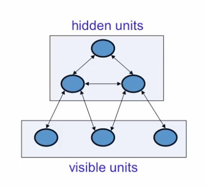
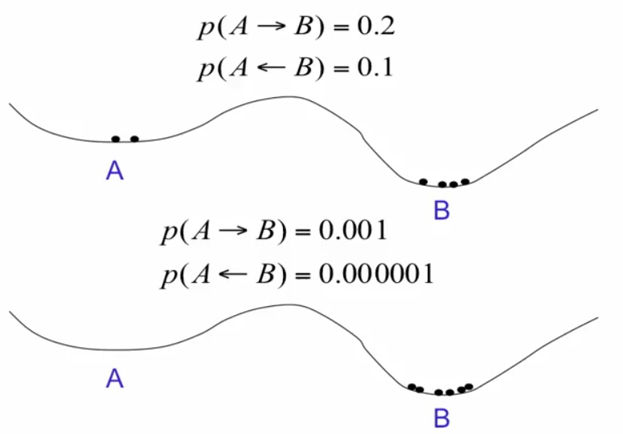

# Hopfield Nets
- Simplest energy based model, their properties derive from a global energy function.
- Composed of binary threshold units with recurrent connections between them.
- Recurrent nets of non-linear units are hard to analyze:
	- Settle to a stable state
	- Oscillate
	- Follow chaotic trajectories that cannot be predicted far into the future
- If the connections are *symmetric*, there is a global energy function.
	- Each binary "configuration" of the whole network has an energy
	- Binary configuration is an assingment of binary values to each neuron in the network.
	- Setting up the right energy function for binary threshold decision rule, causes the net to go down hill in energy and ends up in an energy minima.

## The energy function
- The global energy is the sum of many contributions. Each contribution depends on *one connection weight* and the binary states of *two* neurons :

\begin{equation}
	E = - \sum_i s_i b_i - \sum_{i<j} s_i s_j w_{ij}
\end{equation}

- Energy is bad so low energy is good and that's what the minus signs are doing there.
- The main term, $w_{ij}$ has weight which is the symmetric connection strength between two neurons, $s_i s_j$ are the activities of the two connection neurons.
- The simple *quadratic* energy function makes it possible for each unit to compute *locally* how its state affects the global energy:

\begin{equation}
	\textrm{Energy gap} = \bigtriangleup E_i = E(s_i = 0) - E(s_i = 1) = b_i + \sum_j s_j w_{ij}
\end{equation}

- So its the difference between the energy when $i$ is off and the energy when $i$ is on.

## Settling to an energy minimum
- Start from a random state and then update units *one at a time* in random order.
	- Update each unit to whichever of its two states gives the lowest global energy.

## Memories as energy minima of a neural net
- The binary threhsld decision rule can be used to "clean up" incomplete or corrupted memories.
- The memory could be corrupted by part of it being wrong or undecided, using the net fill out the memory.
- Using energy minima to represent memories gives a content erasable memory.
- So that we can access an item by knowing part of its content.

## Storing memories in a Hopfield net
- If we use activities of $1$ and $-1$, we can store a binary state vector by incrementing the weight between any two units by the product of their activities.
 
\begin{equation}
	\bigtriangleup w_{ij} = s_is_j
\end{equation}

- Nice thing about this simple rule: not error-driven. Just go thru the data once and you're done.

## The storage capacity of a Hopfield net
- Using the storage rule the capacity of a totally connected net with $N$ units is only about $0.15N$ memories, before memories start getting confused with another.
- At $N$ bits per memory -> $0.15N^2$ bits. Not efficient use of bits to store the weights.
- The net has $N^2$ weight and biases.
- After storing $M$ memories, each connection weight has an integer value in the range $[-M, M]$.
- So the number of bits required to store the weights and biases is :

\begin{equation}
	N^2log(2M+1)
\end{equation}

## Spurious minima limit capacity
- Each time we memorize a configuration, we hope to create a new energy minimum.
	- What if two nearby minima merged?
	- This limits the capacity of a Hopfield net.

## Avoiding spurious minima by unlearning
- Let the net settle from a random initial state and then do *unlearning*
- Inspired by unlearning as a model of what dreams are for.
- How much unlearning should we do?

## Increasing the capacity of a Hopfield net
- Instead of trying to store vectors in one shot, cycle through the training set many times
- We lose our nice online property now but gain more efficient storage.
	- Use the perceptron convergence procedure to train each unit to have the correct state given the states of all the other units in that vector.
	- Take the net, put it into the memory state you want, take each unit separately and say would it adopt the state I want?
	- If it would, let the incoming weights alone. If not, change them according to the convergence procedure.
	- Also known as *"pseudo-likelihood"*
	- The idea is get one thing right given all the other things.
	- So for a high dimensional data, try to get the value of one dimension right given the values of other dimensions.

## Hopfield nets with hidden units
- The weights on between units present constraints on good interpretations.
- By finding a low energy state, we find a good interpretation of the input.
- Hopfiel nets combine two ideas :
	- Find a local energy minimum by using a network of symmetrically connected binary threshold units
	- And these local energy minima might correspond to memories.
- Instead of using the net to store memories, use it to construct interpretations of the sensory input.
	- The input is represented by the visible units.
	- The interpretation is represented by the states of the hidden units.
	- The badness of the interpretation is represented by the energy.

### Computational issues
- Using low energy states to represent good interpretation presents two issues :
	- Search: How to avoid the hidden units getting trapped in poor local minima
	- Learning: How do we learn the weights on the between hidden units and visible units and hidden units.

Notice here we don't have a supervior. We are just showing the input and would like it to construct an interpretation.

## Stochastic units to improve search
- Noisy networks find better energy minima
- A Hopfield net always makes decisions that reduce the energy.
	- This makes it impossible to escape from local minima.
- By adding random noise we can escape from poor minima.
- Slowly reduce the noise so that the system ends up in a deep minimum. This is "simulated annealing"

### How temperature affects transition probabilities
- The first graph shows a high temperature transition probabilities and the second low temp.

### Stochastic binary units
- Replace the binary threshold units by binary stochastic units that make biases random decisions
	- The temperature controls the amount of noise
	- Raising the noise level is equivalent to decreasing all the energy gaps between configurations.

\begin{equation}
	p(s_i=1) = \frac{1}{1 + e^{-\bigtriangleup E_i/T}}
\end{equation}

- This is our normal logistic equation. But with the energy gap scaled by a temperature.
- If the temperature is very high that exponent will be roughly zero, so the right hand side will be one over one plus one.
- So the probablity of the unit turning on will be half.
- As we lower the temperature, depending on the sign of delta E, the units will become either more and more firmly on and more and more firmly off.
- From now on, just going to assume binary stochastic units with temperature of 1.

### Thermal equilibrium at a t = 1
- Equilibrium is usually understood as a settled down system but here its not the states of the individual units that are settled down.
- These units are still rattling around at thermal equilibrium
- What settles down is the probability distribution over configurations.
- This settles to the stationary distribution.

