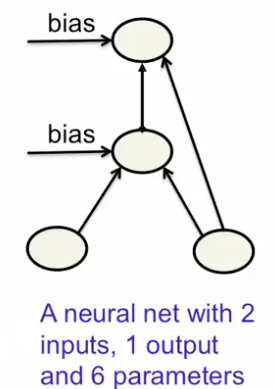

# Full Bayesian Learning
- Don't try to find a single best settings of the parameters.
- Instead, try to find the full posterior distribution over all possible settings.
- For every possible setting, we want a posterior probablity density.
- Extremely computationally intensive, in general impossible for a neural net.
- After computing the posterior distribution across all possible settings, then make predictions by letting each different setting of the parameter make its own prediction.
- Then average all predictions weighting by their posterior probability.

## Approximate full Bayesian learning
- If the neural net has a few parameters, put a grid over the parameter space and evaluate $P(W | D)$.
- Then take the cross product of all those values for all the parameters.
- We can say that the posterior probability in this grid-point is the product of how well it predicts the data, how likely it is under the prior.
- Still expensive but :
	- No gradient descent involved, no local optimum.
- After evaluating each grid point we use them all to make predicitions on test data
	- Also expensive but works better than Maximum Likelihood learning.

\begin{equation}
	p(t_{test} | input_{test}) = \underset{g \in grid}{\sum} p(W_g | D) p(t_{test} | input_{test}, W_g)\sum
\end{equation}

## Example of full Bayesian learning
- Allow each of the 6 weights or biases to have the 9 possible values : -2, -1.5, -1, -0.5, 0.5, 1, 1.5, 2
	- There are $9^6$ grid-points in parameter space
- For each grid-point compute the probability of the observed outputs of all the training cases

# Monte Carlo
- Use a random number generator to move around the space of weight vectors in a random way, but with a bias towards going downhill in the cost function.
- If we get this right, we get this property where we sample weight vectors in proportion to their probability in the posterior distribution.
- By sampling a lot of weight factors, we get a good approximation to the full Bayesian method.
- The number of grid points is exponential in the number of parameters -> Can't make a grid for more than a few parameters.

# Markov chain Monte Carlo
- If we add Gaussian noise in just the right way, there is a wonderful property.
- If we let the weight vectors wander around for long enough before we take a sample, we will get an unbiases sample from the true posterior over weight vectors.
- MCMC makes it feasible to use Bayesian learning with thousands of parameters.
- Method of adding Gaussian noise is another method but its not efficient. There are better ways, so that they don't wander around the weight space for so long before we can start taking samples.

## Full Bayesian learning with mini-batches
- If we compute the gradient of the cost function on a random mini-batch we will get an unbiases estimate with sampling noise.
	- Maybe we can use the sampling noise to provide the noise that an MCMC method needs!
- This makes it possible to use full Bayesian learning for much larger networks where we have to train them with mini-batch to have any hops of ever finishing. 

Q. In Bayesian learning, we learn a probability distribution over parameters of the model.
Then at test time, how should this distribution be used to get predictions with the highest possible accuracy?

A. Sample a lot of parameters using some sampling procedure such as MCMC and average the predictions obtained by using each parameter setting separately. This method makes sure that we use a lot of models and choose the models in proportion to how much we can trust them.

