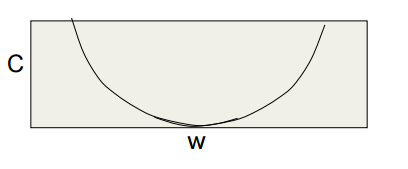
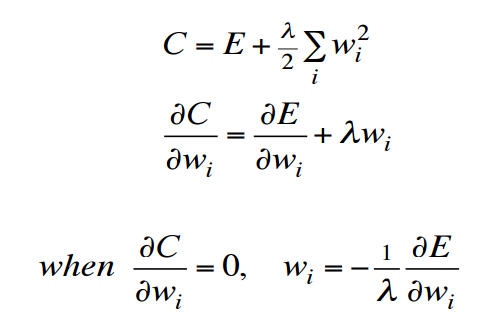
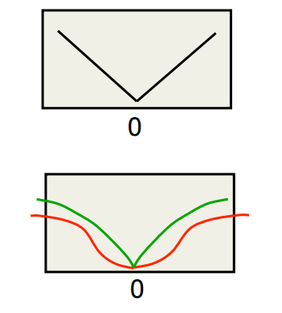

# Neural Networks

## Weight Initialization
One should generally initialize weights with a small amount of noise for symmetry breaking and to prevent 0 gradients.
If using ReLU neurons, it is good practce to initialize them with a slightly positive initial bias to avoid 'dead neurons'.

## Overfitting
- Training data contains info about the regularities in the mapping from input to output. But it also contains
sampling error. That is accidental regularities just because of the particular training cases that were chosen.
- When we fit the model, it cannot tell which regularities are real and which are caused by sampling error.

### Prevention
- Get more data!
- Use a model that has the *right* capacity
  - Enough to fit the true regulatiries
  - Not enough to also fit sputious regularities
 - Average many different models
   - Use models with different forms
   - Train the model on different subsets of the training data ("bagging")
 - Bayesian: Use a single neural network architecture but average the predictions made by many different
 weight vectors.

## Ways to limit the capacity
- Architecture : Limit the number of hidden layers and number of units per layer
- Early stopping: Start with small weights and stop the learning before it overfits
- Weight-decay: Give it a number of hidden layers or units per layer that is a little too large, then penalize large weights using penalties or constraints on their squared values (L2 penalty) or absolute values (L1 penalty).
- Noise: Add noise to the weights or the activities.

## Choosing meta parameters
- Wrong method is using lots of alternatives, easy to do but it gives a false impression of how well the method works
- The setting that works best on test set are unlikely to work as well on a new test set drawn from the same distribution.
- Extreme example is where the test set is so random that does not depend on the input.
  - The best architecture will do better than chance on the test set but not expected to do so on a new test set.

### Cross-validation : Better way
- Divide dataset into:
  - Training data: used for learning the parameters
  - Validation data: not used for learning just for deciding what settings work best
  - Testing data: used to get the final data, unbiased estimate
- Divide the dataset into one final test set and $N$ other subsets and train on all but one of those subsets to get
$N$ different estimates of the validation error rate 
  - Called N-fold cross-validation
  - The $N$ estimates are NOT independent.
  
## Early stopping
- When we have a big model and no time to train a model many times or varying weight penalties. 
- Instead start with small weights and as the model trains watch the performance on the validation set.
- As it starts to get worse, stop training.
- The performance on the validation set may fluctuate particularly if the measuring error rate rather than a 
squared error or cross entropy. So hard to decide but keep going until sure and go back to where things were best.

### Why small weights lower the capacity?
- When the weights are very small, every hidden unit is in its linear range
  - A net wirh a large layer of hidden units is linear
  - It has no more capacity than a linear net in which inputs are mapped to the output
- As the weights grow, the hidden units start using their non-linear ranges so the capacity grows.

So in early stopping, we stop when it has the right number of parameters. That is, its optimized the trade off between fitting the true regularities in the data and fitting the spurious regularities.

## Weight decay
- Standard L2 weight penalty involves adding an extra term to the cost function that penalizes the squared weights.
  -This keeps the weights small unless they have big error derivatives
  
 So looking at the penalty term below, we get this parabolic cost.

Sometimes it works better to penalize the absolute values of the weights, like the V shape below.
Plus to use a weight penalty that has negligible effect on large weights, because L1 allows a few large weights.

## Weight constraints
- Instead of penalizing the squared value of each weight separately, put a constraint on the maximum squared length of the incoming weight vector of each unit.
- Advantages over weight penalties:
  - Easier to select the sensible value because logistic units have a natural scale (so we know what a weight of 1 means)
  - They prevent hidden unit getting stuck near zero with all their weights being tiny and not doing anything useful.
  - Prevent weights exploding

N.B. The penalties are just the La Grange multiplier required to keep the constraints satisfied. 
  

