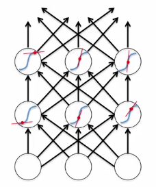

# Recurrent Neural Networks

The idea behind RNNs is the ability to connect previous information to the present task. 
One limitation of vanilla neural networks is that they accept a fixed-sized vector as input and produce a fixed-sized vector as output. 

RNNs accept their own outputs as inputs. The most basic model would be at time step $t$, for $t \in {0,1,...,n}$. It accepts $X_t$ vector and a previous state vector, $S_{t-1}$ as input.
It then produces a state vector $S_t$ and a prediction.

\begin{equation} 
S_t = tanh(W(X_t \| S_{t-1}) + b_s)
\end{equation}

They are powerful because they combine two properties:
- Distributed hidden state that allows them to store info about the past efficiently.
- Non-linear dynamics that allows them to update their hidden state in complicated ways.

Recurrent neural nets are \textit{deterministic}. So think of the hidden state of an RNN as the equivalent to the deterministic probability distribution over hidden states in a linear dynamical system or hidden Markov model.

## RNN Computation
They accept an input vector $x$ and give an output vector $y$. This output vector's contents are influenced not only by the input you feed in, but on the entire history of inputs that have been fed in.
The RNN has an internal state that gets updated every time 'step' function is called. This function updates the state and returns the output vector. So this function, combines the previous hidden state and the current input to obtain the new state. You add the two, and then squash them using the activation function, say tanh to get the new state vector.

## Computation Formulas
- $s_t$ is the hidden state at time step $t$. It's the 'memory' of the network. 
- $s_t$ is calculated based on the previous hidden state and the input at the current step: $s_t = f(Ux_t + W_{s_{t-1}})$. - - The function $f$ usually is a nonlinearity such as tanh or ReLU. $s_{-1}$ which is required to calculate the first hidden state is typically initialized to all zeros.

A few notes :
- Think of hidden state $s_t$ as the memory of the network. $s_t$ captures information about what happened in all the previous time steps. The output at step $o_t$ is calculated solely based on the memory at time $t$.
- Unlike vanilla deep neural network, which uses different parameter at each layer, a RNN shares the same parameters($U,V,W$) across all steps. This reflects the fact that we are performing the same task at each step, just with different inputs. This reduces the total number of parameters we need to learn!
- When you see diagrams showing outputs at each time step, depending on the task you may not care about all! So in some cases you would only care about the final step. We may not even need inputs at each time step. The main feature of an RNN is its hidden state, which captures information about a sequence.

### Backpropagation through time
- Modify the backprop to incorporate linear constraints between the weights.
- We compute the gradients as usual, then modify the gradients so that they satisfy the constraint.

\begin{align}
Constrain: w_1 = w_2 \\
Need: \bigtriangleup w_1 = \bigtriangleup w_2 \\
compute: \frac{\partial E}{\partial w_1} & \frac{\partial E}{\partial w_2} \\
use \frac{\partial E}{\partial w_1} + \frac{\partial E}{\partial w_2}
\end{align}

- So if the weights started off satisfying the constraints, they will continue to do so.
- Think of BPTT in the time domain:
  - The forward pass builds up a stack of the activities of all the units at each time step.
  - Backward pass peels activities off the stack to compute the error derivatives at each time step.
  - After the backward pass we add together the derivatives at all the different times for each weight.

### Initial activity state
Learn the initial states as learned parameters.
 - Start off with initial random guess for the initial states.
 - At the end of each training sequence, backpropagate through time all the way to the initial states to get the gradient
  of the error function w.r.t. each initial state.
 - Adjust the initial states by following the negative gradient.

### Input to RNN
Several ways:
- Specify the initial states of all the units.
- Specify the initial states of a subset of the units.

### Teaching signals
Several ways:
- Specify desired final activities of all the units.
- Specify desired activities of all units for the last few steps.

### What the network learns
- It learns distinct patterns of activity for each hidden unit. These patterns correspond to the nodes in the finite state automaton.
  - Not to confuse units in a neural net with nodes in a finite state automaton. Nodes are like activity vectors.
  - The automaton is restricted to be in exactly one state at each time. So the hidden units can have exactly one vector of activity at each time
  - RNN can emulate a finite state automatonm but it is exponentially more powerful. With $N$ hidden neurons it has $2^N$ possible binary activity vector but only $N^2$ weights (here assuming input is 2, say its a binary sum).

### Training difficulty
- In the forward pass we use squashing functions to prevent the activity vectors from exploding.

- The backward pass is completely linear. If you double the error derivatives at the final layer, all the error derivatives will double.
- Look at the red dots on the blue curves, suppose those are the activity levels of the neurons on the forward pass.
- When we back propagate, we use the gradients of the blue curves at those red dots.
- Once the forward pass finishes the slope of that tangent is fixed.
- Now we back propagate and the back propagation is like going forwards through a linear system in which the slope of the non-linearity has been fixed.

### The problem of exploding or vanishing gradients
- Of coure every time we back propagate, the slopes will be different because they were determined by the forward pass.
- But during the back propagation, its a linear system and so it suffers from a problem of linear systems, which is when we iterate they tend to either explore or die :(
- This means when we backpropagate through time gradients that are many steps earlier than the targets arrive will be tiny. Similarly if the weights are big, the gradients will explore. Meaning when we back propagate through time, the gradients will get huge and wipe out all your knowledge.

### How to avoid
- Can avoid by initializing the weights very carefully.
- Altho still hard to detect that the current target output depends on an input from many time-steps ago.
  - So RNNs have difficulty dealing with long-range dependencies.

### Four effective ways to learn an RNN
- Long Short Term Memory
- Hessian Free optimization: Deal with the vanishing gradients problem by using a fancy optimizer that can detect directions with a tiny gradient but even smaller curvature.
- Echo State Networks: Initialize the input to hidden, hidden to hidden and output to hidden connections very carefully so that the hidden state has a huge reservoir of weakly coupled oscillators which can be selectively driven by the input.
- Good initialization with momentum
  
# Eco State Networks
- Trick to initialize the connections in the recurrent neural network in such a way that it has a big reservoir 
of coupled oscillators.
- So provided the input, it converts that input into the states of oscillators.
- This gets rid of the problem of learning hidden to hidden connections or input to hidden connections.

The key idea is very similar to the early days perceptrons.
- A very simple way to learn a feedforward network is to make the early layers random and fixed.
- Then we just learn the last layer which is a linear model that uses the transformed inputs to predict output.
- We set the hidden to hidden weights randomly so that the length of the activity vector stays the same after
each iteration. This allows the input to echo around the network for a long time.
- It is also important to use sparse connectivity (i.e. set most of the weights to zero)

## Good aspects of ESN
- Can be trained very fast because they just fit a linear model
- Demonstrate the importance of a sensible weight initialization
- Can do impressive modeling of one-dimensional time-series.

