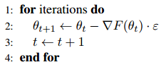

# Gradient Descent

## Overview
- The $\textbf{directional derivative}$ in direction $u$(a unit vector) is the slope of function $f$ in direction $u$
- To minimize $f$ we can decrease $f$ by moving in the direction of the negative gradient
- This is known as $\textbf{method of steepest descent}$ or gradient descent
- Steepest descent proposes a new point
    - $x^{'} = x - \epsilon \triangledown_x f(x)$
    - $\epsilon$ is the $\textbf{learning rate}$ i.e. size of the step
- Steepest descent converges when every element of the gradient is zero (or close)

## More Formal Notation

Say we have chosen an appropriate class of $F$ functions. Finding the global minimizer
of the training error for most interesting choices of $F$ is $NP$-hard, but in practice there are
many choices of smoothly-parameterized $F$ that are easy to optimize with gradient methods.

Let the function $F_{\theta} \in F$ be a differentiable parameterization of $F$ where $\theta \in R^{|\theta|}$
and $|\theta|$ is the number of parameters. Assume the loss $L$ is a differentiable function of its arguments.

\begin{equation}
  Train_S(\theta) \equiv Train_S(f_{\theta}) = E_{(x,y)\approx S} [L(f(\theta);y)]
\end{equation}

Gradient Descent (GD) is a greedy method for minimizing arbitrary
differentiable functions.
Given a function $F(\theta)$, GD operates as follows :

# Momentum
Momentum methods use gradient info to update the parameters in a direction that is more effective than
steepest descent by accumulating speed in directions that consistently reduce the cost function.
Formally, a momentum method maintains a velocity vector $v_t$ which is updated as follows:

\begin{align}
  v_{t + 1} = \mu v_t - \epsilon \bigtriangledown F(\theta_t) \\
  \theta_{t+1} = \theta_t + v_{t + 1}
\end{align}

The momentum decay coefficient $\mu \in [0,1)$ controls the rate at which old gradients are discarded.
Its physical interpretation is the "friction" of the surface of the objective function, and its
magnitude has an indirect effect on the magnitude of the velocity.

Side Note: A variant of momentum is known as Nesterov's accelerated gradient.

